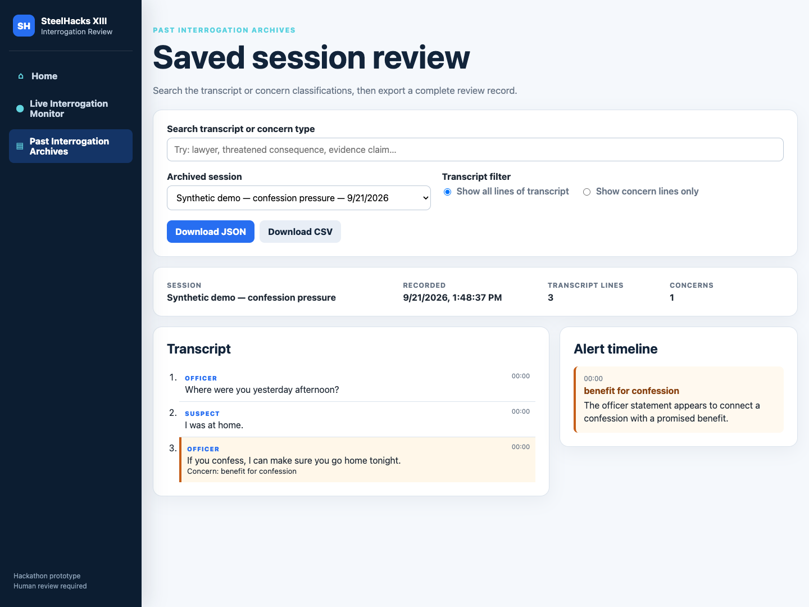
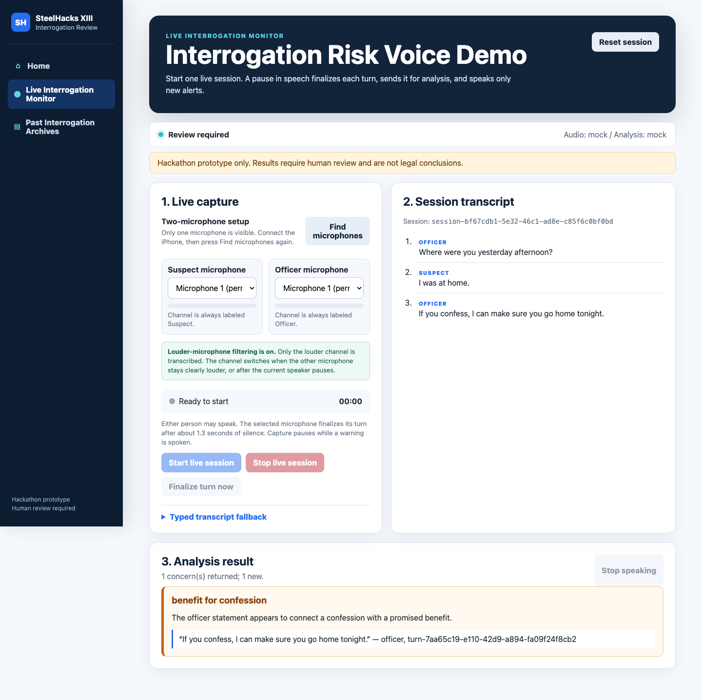
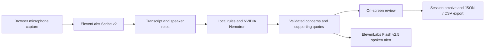

# Themis

### A voice-based assistant for reviewing interrogation dialogue

Built at **SteelHacks XIII · September 19–20, 2026**.

Themis listens to simulated interrogation dialogue, highlights potential rights-related concerns, and gives short spoken alerts. Reviewers can follow the transcript as a session unfolds, then search saved conversations and inspect the evidence behind each alert.

**[View the presentation](docs/presentation/Themis-Final-Presentation.pdf)** · **[Download the PowerPoint](docs/presentation/Themis-Final-Presentation.pptx)** · **[Explore the project materials](docs/README.md)** · **[Run the demo](docs/development/running-locally.md)**

*The working browser interface, shown with synthetic dialogue in mock mode.*

## What we built

- **Live conversation capture.** Two microphone channels are assigned to officer and suspect roles. The louder channel is transcribed, and pauses finalize each turn.
- **Evidence-linked alerts.** Potential concerns include pressure to confess, threats, and continued questioning after a request for counsel. Results pair explanations with quotes from the transcript.
- **Spoken warnings.** ElevenLabs produces short alerts for newly detected concerns; text remains available when audio fails.
- **Session review.** Save a session in the browser, search its transcript, filter to concern lines, and export the review record as JSON or CSV.

## How it works

The Python backend connects speech services and analysis to a browser interface built with HTML, CSS, and JavaScript. The reasoning module uses local rules for clear cases and NVIDIA Nemotron for ambiguous input, then checks supporting quotes and speaker references against the submitted transcript. The no-key demo uses mock providers.

| Component | Technology |
| --- | --- |
| Audio input and output | ElevenLabs Scribe v2 and Flash v2.5 |
| Reasoning | NVIDIA Nemotron 3.5 Lightning, local classification, Pydantic validation |
| Main application | Python, FastAPI, browser MediaRecorder and Web Audio APIs |
| Earlier interface and reasoning demos | Streamlit |
| Verification | pytest, synthetic dialogue fixtures |

## The hackathon

The team split the work across audio, reasoning, interface and integration, and rules, testing, and presentation. The main engineering challenges were connecting those components, keeping speaker roles consistent, controlling model latency and token use, and preventing spoken alerts from feeding back into microphone capture.

The [final presentation](docs/presentation/Themis-Final-Presentation.pdf) introduces the project and its workflow. The [build archive](docs/archive/README.md) preserves the original role plans and earlier slides. Codex and Cursor helped implement the team's plan and framework; ChatGPT image generation supported the presentation scenes.

## Explore the repository

| Location | Contents |
| --- | --- |
| [`app/`](app/) | Main FastAPI application, audio adapters, and browser interface |
| [`steelhacks_reasoning/`](steelhacks_reasoning/) | Classification, conversation context, and evidence validation |
| [`tests/`](tests/) | Automated tests and synthetic dialogue fixtures |
| [`docs/presentation/`](docs/presentation/) | Final slides and PDF preview |
| [`docs/development/`](docs/development/) | Local setup, integration contracts, and reasoning notes |
| [`docs/archive/`](docs/archive/) | Original team plans, earlier presentation, and Git practice files |
| [`examples/streamlit/`](examples/streamlit/) | Earlier Streamlit interface prototype |
| [`demo_app.py`](demo_app.py) | Standalone Streamlit reasoning demonstration |

## Project status

**The hackathon is complete.** This repository presents the prototype and preserves its source and project materials.

Themis flags potential concerns for human review. It does not determine whether a legal violation occurred or replace legal advice. Transcription, speaker assignment, and analysis can be wrong. The demo uses simulated dialogue; its browser-local archives are a prototype feature, not a secure evidence-management system.
